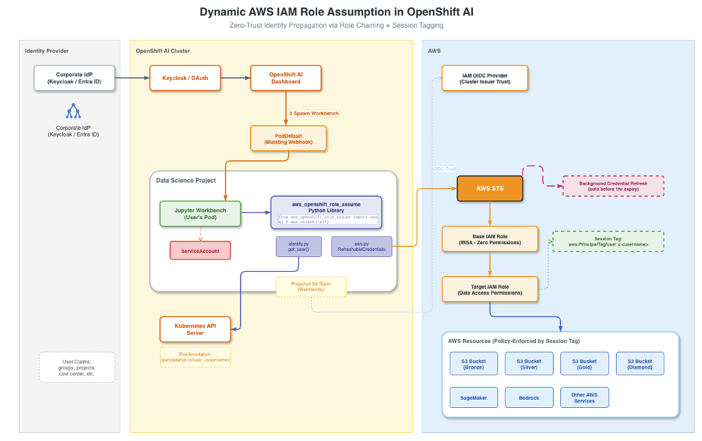

# AWS OpenShift Role Assume

[](https://opensource.org/licenses/Apache-2.0)
[](https://pypi.org/project/aws-openshift-role-assume/)
[](https://pypi.org/project/aws-openshift-role-assume/)

This package provides a frictionless way to create **auto-refreshing** boto3 sessions inside [OpenShift AI](https://www.redhat.com/en/technologies/cloud-computing/openshift/openshift-ai) (RHODS) Jupyter workbenches, with dynamic [AWS IAM Role](https://docs.aws.amazon.com/IAM/latest/UserGuide/id_roles.html) assumption and [STS Session Tagging](https://docs.aws.amazon.com/IAM/latest/UserGuide/id_session-tags.html) based on the authenticated OpenShift user identity.

Data scientists simply call `aws.client('s3')` and the library handles everything else -- user detection, IRSA WebIdentity authentication, role chaining, session tagging, and background credential refresh -- all invisible to the end user.

## How It Works

The library is designed to work with a corporate Identity Provider (Keycloak, Entra ID, etc.) federated into OpenShift. The user never authenticates to AWS directly -- their corporate identity flows through automatically.

1. The user logs into the **OpenShift AI Dashboard** via the corporate IdP (Keycloak / Entra ID). They do not need to log in a second time or provide any AWS credentials.
2. When the user spawns a Jupyter Workbench, OpenShift AI stamps the pod with an immutable annotation (`opendatahub.io/username`) that reflects the authenticated Keycloak identity.
3. The library queries the **Kubernetes API** to extract this annotation from the pod. Because the annotation is set by the platform (not the user), it cannot be spoofed.
4. A **projected ServiceAccount token** (Kubernetes-signed JWT) is mounted into the pod. The library reads this token and sends it to **AWS STS** via `AssumeRoleWithWebIdentity` to assume the Base IAM Role.
5. The library immediately chains to the **Target IAM Role** via `AssumeRole`, passing the Keycloak user identity as an AWS STS Session Tag (`aws:PrincipalTag/user`).
6. AWS IAM policies evaluate the session tag to dynamically grant or deny access to resources (S3, SageMaker, Bedrock, etc.) on a per-user basis.
7. Credentials are automatically **refreshed in the background** before the 1-hour role-chaining expiry using `botocore.credentials.RefreshableCredentials`.

## How the Projected ServiceAccount Token Works

The file at `/var/run/secrets/eks.amazonaws.com/serviceaccount/token` is **not** fetched from AWS. It is a Kubernetes-native token generated and managed entirely by the kubelet on the node.

1. The PodDefault (or projected volume spec) tells Kubernetes to mount a **projected ServiceAccount token** into the pod.
2. At pod startup, the **kubelet** calls the Kubernetes API's `TokenRequest` endpoint and generates a short-lived JWT, signed by the cluster's service account signing key.
3. The JWT contains claims identifying the pod's ServiceAccount and namespace. The `audience` field is set to `sts.amazonaws.com`, which makes it acceptable to AWS STS.
4. The kubelet **automatically rotates** the token on disk before `expirationSeconds` elapses (e.g. every 24 hours). The pod does not need to do anything to renew it.
5. When the library calls `sts:AssumeRoleWithWebIdentity`, it reads this file and sends the Kubernetes-signed JWT to AWS STS. AWS validates the token signature against the cluster's OIDC provider (registered as an IAM OIDC Identity Provider), and if the trust policy matches, returns temporary AWS credentials.

```
Kubelet (on node)
  --> signs a JWT for the pod's ServiceAccount (audience: sts.amazonaws.com)
  --> writes it to /var/run/secrets/eks.amazonaws.com/serviceaccount/token
  --> auto-rotates before expiry

This library
  --> reads the token file
  --> sends it to AWS STS (AssumeRoleWithWebIdentity) --> Base Role
  --> chains AssumeRole with Session Tags            --> Target Role
  --> returns auto-refreshing boto3 credentials
```

## Requirements

- Python 3.9 or later
- An OpenShift AI (RHODS) cluster with a corporate IdP (Keycloak / Entra ID) configured as the OAuth identity provider
- IRSA (IAM Roles for Service Accounts) configured with the cluster's OIDC issuer registered in AWS IAM
- A mechanism to inject IRSA credentials into workbench pods (see [Injecting IRSA Credentials](#injecting-irsa-credentials-into-workbench-pods) below). This is necessary because OpenShift AI auto-generates a new ServiceAccount per workbench, overriding any pre-configured IRSA annotations.
- An AWS IAM **Base Role** trusted by the cluster's OIDC provider
- An AWS IAM **Target Role** with resource policies that evaluate `aws:PrincipalTag/user`

## Install

- From PyPI

```bash
pip install aws-openshift-role-assume
```

- From source

```bash
git clone https://github.com/your-org/aws-openshift-role-assume.git
cd aws-openshift-role-assume
pip install ./
```

## Configuration

The library is configured entirely through environment variables. No code changes or config files are needed.

| Name | Description | Type | Default |
| --- | --- | --- | --- |
| `TARGET_ROLE_ARN` | The ARN of the Target IAM Role to assume (the role that holds actual resource permissions). | string | *Required* |
| `AWS_DEFAULT_REGION` | The AWS region for STS and service calls. | string | `us-east-1` |
| `AWS_ROLE_ARN` | The ARN of the Base IAM Role (IRSA). Injected automatically by the PodDefault or IRSA webhook. | string | *Injected by IRSA* |
| `AWS_WEB_IDENTITY_TOKEN_FILE` | Path to the projected ServiceAccount token. Injected automatically by the PodDefault or IRSA webhook. | string | *Injected by IRSA* |

## Usage

```python
from aws_openshift_role_assume import aws

# Create an auto-refreshing S3 client -- that's it.
s3 = aws.client('s3')
print(s3.list_buckets())
```

The user identity is resolved automatically from the Keycloak-authenticated pod annotation. You can also inspect it directly:

```python
from aws_openshift_role_assume import get_user

print(get_user())  # e.g. "user1@company.com"
```

Or obtain a raw boto3 `Session` for advanced use cases:

```python
from aws_openshift_role_assume import get_boto3_session

session = get_boto3_session()
sagemaker = session.client('sagemaker')
bedrock = session.client('bedrock-runtime')
```

## Identity Resolution

In production, identity comes from the corporate IdP (Keycloak / Entra ID) via the pod annotation that OpenShift AI sets when the user spawns a workbench. The library resolves identity in the following order:

| Priority | Source | Description |
| --- | --- | --- |
| 1 | `opendatahub.io/username` pod annotation | **Primary (production)**. Set by OpenShift AI from the authenticated Keycloak / OAuth session. Immutable and cannot be spoofed by the user. |
| 2 | `opendatahub.io/user` pod label | Fallback annotation format used by some OpenShift AI versions. |
| 3 | `RHOAI_USER` environment variable | **Local testing only** (see below). |
| 4 | `JUPYTERHUB_USER` environment variable | Legacy JupyterHub injection, present in some older RHODS configurations. |
| 5 | `"unknown_user"` | Default if all methods fail. |

### Testing without Keycloak (htpasswd / local users)

For local development or demo environments where Keycloak is not configured, OpenShift can use the built-in `htpasswd` identity provider. In this case, the `opendatahub.io/username` annotation still works -- OpenShift AI sets it from whatever OAuth provider is active, including htpasswd.

If you are testing completely outside of OpenShift (e.g. on a local machine), you can override the identity by setting the `RHOAI_USER` environment variable:

```bash
export RHOAI_USER="testuser1"
```

This skips the Kubernetes API lookup entirely and uses the provided value as the session tag. **Do not use this in production** -- it bypasses the identity verification that makes this architecture secure.

## Architecture



## Injecting IRSA Credentials into Workbench Pods

When a user creates a workbench through the OpenShift AI Dashboard, the platform **auto-generates a new Kubernetes ServiceAccount** for that workbench (e.g. `user1-my-workbench`). This overrides any pre-existing ServiceAccount you may have configured with the `eks.amazonaws.com/role-arn` annotation, meaning the pod will not receive the projected IRSA token by default.

To ensure every workbench pod gets the Base Role ARN and the projected WebIdentity token injected automatically, you need one of the following mechanisms:

### Option 1: Kubeflow PodDefault (Recommended)

A `PodDefault` mutating webhook intercepts workbench creation and injects the required environment variables and volume mounts, regardless of which ServiceAccount OpenShift AI assigns.

```yaml
apiVersion: kubeflow.org/v1alpha1
kind: PodDefault
metadata:
  name: inject-aws-irsa
  namespace: <data-science-project>
spec:
  desc: "Injects AWS IRSA credentials into workbench pods"
  selector:
    matchLabels:
      opendatahub.io/dashboard: "true"
  env:
    - name: AWS_ROLE_ARN
      value: "arn:aws:iam::123456789012:role/OpenShiftAIBaseRole"
    - name: AWS_WEB_IDENTITY_TOKEN_FILE
      value: "/var/run/secrets/eks.amazonaws.com/serviceaccount/token"
    - name: TARGET_ROLE_ARN
      value: "arn:aws:iam::123456789012:role/DataScienceTargetRole"
  volumeMounts:
    - mountPath: /var/run/secrets/eks.amazonaws.com/serviceaccount
      name: aws-iam-token
      readOnly: true
  volumes:
    - name: aws-iam-token
      projected:
        defaultMode: 420
        sources:
          - serviceAccountToken:
              audience: sts.amazonaws.com
              expirationSeconds: 86400
              path: token
```

PodDefault requires the Kubeflow Notebook Controller or the Data Science Pipelines component to be enabled in your `DataScienceCluster`. See [Kubeflow PodDefault documentation](https://www.kubeflow.org/docs/components/notebooks/setup/).

### Option 2: Kyverno / Admission Webhook

Use a [Kyverno](https://kyverno.io/) `ClusterPolicy` or a custom `MutatingWebhookConfiguration` to automatically patch the auto-generated ServiceAccount with the `eks.amazonaws.com/role-arn` annotation whenever a new workbench is created.

### Option 3: Kubernetes CronJob

For clusters where installing additional components (Kyverno, PodDefault controller) is not desirable, a simple `CronJob` can periodically scan for unannotated ServiceAccounts in the data science namespace and patch them automatically. This uses only built-in Kubernetes primitives.

```yaml
apiVersion: batch/v1
kind: CronJob
metadata:
  name: patch-irsa-serviceaccounts
  namespace: <data-science-project>
spec:
  schedule: "*/5 * * * *"
  jobTemplate:
    spec:
      template:
        spec:
          serviceAccountName: sa-patcher
          restartPolicy: OnFailure
          containers:
            - name: patch
              image: registry.redhat.io/openshift4/ose-cli:latest
              command:
                - /bin/bash
                - -c
                - |
                  ROLE_ARN="arn:aws:iam::123456789012:role/OpenShiftAIBaseRole"
                  ANNOTATION="eks.amazonaws.com/role-arn"
                  for sa in $(oc get sa -o jsonpath='{.items[*].metadata.name}'); do
                    current=$(oc get sa "$sa" -o jsonpath="{.metadata.annotations.eks\.amazonaws\.com/role-arn}" 2>/dev/null)
                    if [ -z "$current" ]; then
                      oc annotate sa "$sa" "${ANNOTATION}=${ROLE_ARN}" --overwrite
                      echo "Patched ServiceAccount: $sa"
                    fi
                  done
```

The `sa-patcher` ServiceAccount needs RBAC permissions to `get`, `list`, and `patch` ServiceAccounts in the target namespace.

### Option 4: Manual ServiceAccount Patching

Patch the auto-generated ServiceAccount after workbench creation. This is the least automated option and is only suitable for demos or single-user testing.

```bash
oc annotate serviceaccount <workbench-sa> \
  eks.amazonaws.com/role-arn=arn:aws:iam::123456789012:role/OpenShiftAIBaseRole \
  -n <data-science-project>
```

The workbench must be restarted after patching for the projected token to be mounted.

## AWS IAM Setup

### Base Role Trust Policy

The Base Role is assumed via IRSA WebIdentity. It has zero resource permissions -- its only purpose is to allow chaining to the Target Role.

```json
{
  "Effect": "Allow",
  "Principal": {
    "Federated": "arn:aws:iam::123456789012:oidc-provider/<cluster-oidc-issuer>"
  },
  "Action": "sts:AssumeRoleWithWebIdentity",
  "Condition": {
    "StringLike": {
      "<cluster-oidc-issuer>:sub": "system:serviceaccount:*:*"
    }
  }
}
```

### Target Role Policy (Session Tag Enforcement)

The Target Role grants access to specific resources based on the `aws:PrincipalTag/user` session tag.

```json
{
  "Effect": "Allow",
  "Action": ["s3:ListBucket", "s3:GetObject"],
  "Resource": [
    "arn:aws:s3:::my-bronze-bucket",
    "arn:aws:s3:::my-bronze-bucket/*"
  ],
  "Condition": {
    "StringEquals": {
      "aws:PrincipalTag/user": "user1"
    }
  }
}
```

## Baking into a Custom Notebook Image (Golden Image)

For production deployments, the recommended approach is to pre-install this package into a custom notebook image so that data scientists have it available out of the box without running `pip install` in every workbench.

```dockerfile
FROM quay.io/modh/odh-minimal-notebook-container:v3

USER 0

RUN pip install --no-cache-dir aws-openshift-role-assume && \
    chmod -R g+w /opt/app-root/lib/python3.11/site-packages && \
    fix-permissions /opt/app-root -P

USER 1001

WORKDIR /opt/app-root/src
ENTRYPOINT ["start-notebook.sh"]
```

Once built and pushed to your registry, register the image in OpenShift AI under **Settings > Notebook images** so it appears as a selectable workbench image for all users in the cluster.

For detailed guidance on building and registering custom notebook images, see:

- [Custom Notebooks - AI on OpenShift](https://ai-on-openshift.io/odh-rhoai/custom-notebooks/)
- [Creating a Workbench - Red Hat OpenShift AI Self-Managed 3.4](https://docs.redhat.com/en/documentation/red_hat_openshift_ai_self-managed/3.4/pdf/creating_a_workbench/Red_Hat_OpenShift_AI_Self-Managed-3.4-Creating_a_workbench-en-US.pdf)

## API Reference

### `aws.client(service_name, **kwargs)`

Returns a boto3 client with auto-refreshing credentials.

```python
s3 = aws.client('s3')
sagemaker = aws.client('sagemaker')
```

### `aws.resource(service_name, **kwargs)`

Returns a boto3 resource with auto-refreshing credentials.

```python
s3 = aws.resource('s3')
bucket = s3.Bucket('my-bucket')
```

### `get_boto3_session()`

Returns a `boto3.Session` backed by `RefreshableCredentials`.

### `get_user()`

Returns the resolved OpenShift user identity as a string.

## Contributing

Contributions are very welcome. Please open an issue or submit a pull request.

## License

Distributed under the terms of the [Apache 2.0](LICENSE) license.
